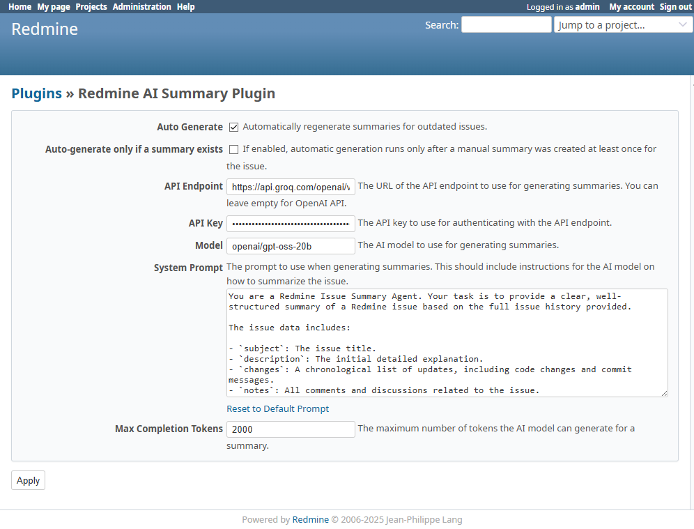
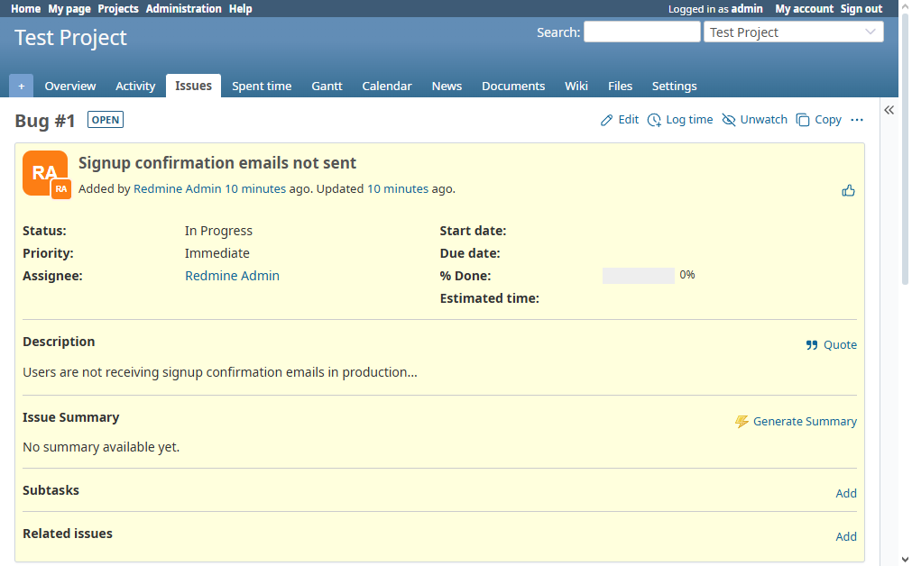
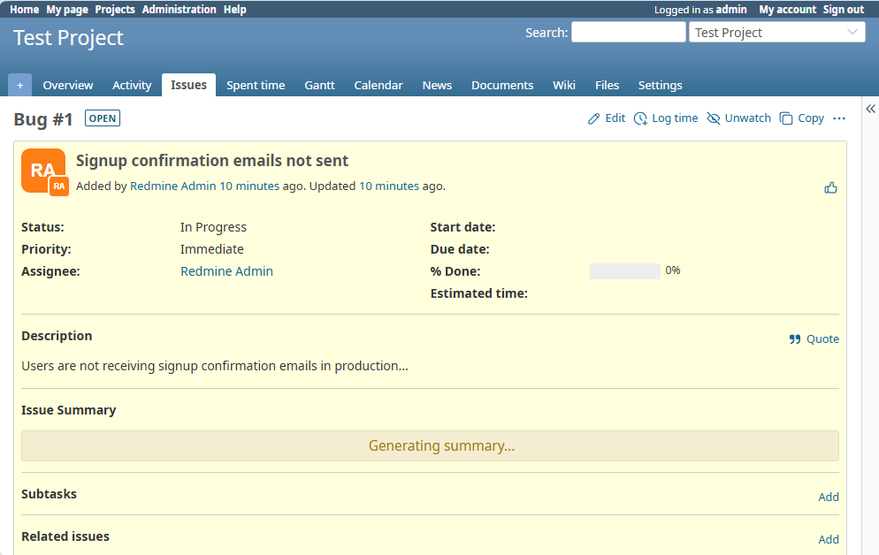
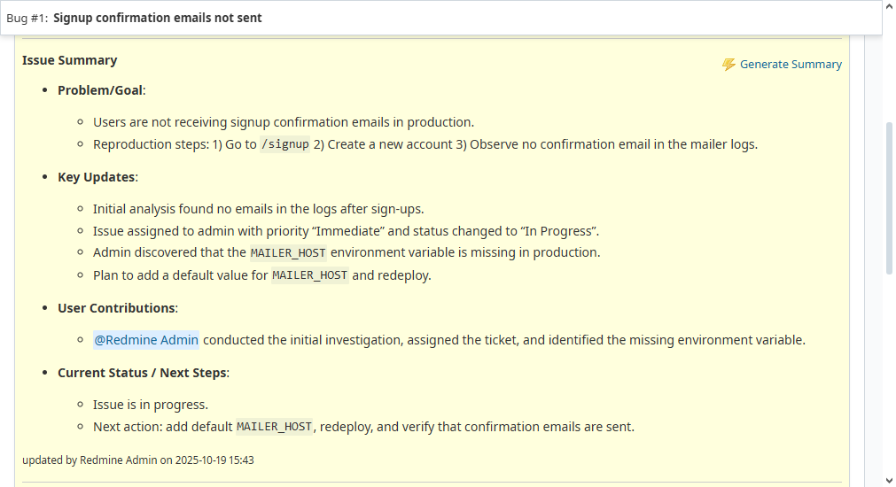

# Redmine AI Summary Plugin

This plugin for Redmine generates AI-powered summaries for issues, providing quick insights and improving project management efficiency.

## Features

*   **Manual Summary Generation**: Generate a summary for any issue with a single click.
*   **Automatic Summary Generation**: Automatically generate a summary when a new note is added to an issue.
*   **Permissions Control**: Fine-grained access control through Redmine's permission system.
*   **Customizable**: Configure the AI model, API endpoint, and prompts to suit your needs.
*   **Localizable**: Easily translate the plugin into different languages.

## Installation

1.  **Clone the repository** into your Redmine `plugins` directory:
    ```bash
    cd /path/to/redmine/plugins
    git clone https://github.com/tuzumkuru/redmine_ai_summary.git
    ```
2.  **Install dependencies**:
    ```bash
    cd /path/to/redmine
    bundle install
    ```
3.  **Run database migrations**:
    ```bash
    cd /path/to/redmine
    bundle exec rake redmine:plugins:migrate RAILS_ENV=production
    ```
4.  **Restart Redmine**.

## Configuration

To configure the plugin, go to **Administration > Plugins** and click on **Configure** for the **Redmine AI Summary Plugin**.

*   **Auto Generate**: Enable or disable automatic summary generation when a new note is added.
*   **Auto-generate only if a summary exists**: If enabled, automatic generation will only run if a manual summary has been created for the issue at least once. 
*   **API Endpoint**: The endpoint of your OpenAI-compatible API.
*   **API Key**: Your API key. The key is stored securely and will be masked in the user interface.
*   **Model**: The AI model to use for summary generation (e.g., `gpt-4o-mini`).
*   **System Prompt**: The instructions given to the AI model on how to summarize the issue.
*   **Max Tokens**: The maximum number of tokens for the generated summary.



## Usage

For the plugin to be active on a project, you must enable the **AI Summary** module in the project's settings.

1.  Navigate to the project's **Settings** page.
2.  Go to the **Modules** tab.
3.  Check the box for **AI Summary**.

### Manual Generation

1.  Navigate to any issue in a project where the module is enabled.
2.  If you have the required permissions, you will see a "Generate Summary" button.
3.  Click the button to generate a new summary. The latest summary will be saved and displayed.

Before generating a summary, the issue page will look like this:



While the summary is being generated, a loading indicator is displayed:



Once the summary is complete, it is displayed on the issue page:



### Automatic Generation

When *Auto‑Generate* is enabled, the plugin reacts to **any** journal entry created for an issue (notes, status changes, attachments, etc.). The journal’s `after_create` callback checks the plugin settings and, if allowed, creates or updates the `IssueSummary` and enqueues a background job to generate the AI summary.

If the *Auto‑Generate only if a summary exists* option is turned on, the plugin will only run the generation when a manual summary has already been created for that issue.

## Future Development

No future development is as planned for now. 

## Contributing

Contributions are welcome! Please feel free to submit a pull request or open an issue on the GitHub repository.

## License

This plugin is licensed under the MIT License. See the [LICENSE](LICENSE) file for details.