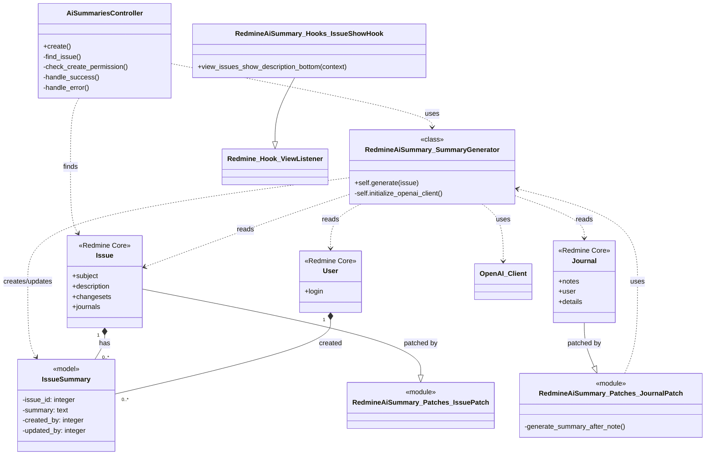

# Redmine AI Summary Class Diagram

This diagram illustrates the relationships between the main classes and modules in the Redmine AI Summary plugin.

```mermaid
classDiagram
    class AiSummariesController {
        +create()
        -find_issue()
        -check_create_permission()
        -handle_success()
        -handle_error()
    }

    class RedmineAiSummary_SummaryGenerator {
        <<class>>
        +self.generate(issue)
        -self.initialize_openai_client()
    }

    class IssueSummary {
        <<model>>
        -issue_id: integer
        -summary: text
        -created_by: integer
        -updated_by: integer
    }

    class RedmineAiSummary_Hooks_IssueShowHook {
        +view_issues_show_description_bottom(context)
    }

    class RedmineAiSummary_Patches_IssuePatch {
        <<module>>
    }

    class RedmineAiSummary_Patches_JournalPatch {
        <<module>>
        -generate_summary_after_note()
    }

    class Issue {
        <<Redmine Core>>
        +subject
        +description
        +changesets
        +journals
    }

    class Journal {
        <<Redmine Core>>
        +notes
        +user
        +details
    }
    
    class User {
        <<Redmine Core>>
        +login
    }

    AiSummariesController ..> RedmineAiSummary_SummaryGenerator : uses
    AiSummariesController ..> Issue : finds
    RedmineAiSummary_SummaryGenerator ..> IssueSummary : creates/updates
    RedmineAiSummary_SummaryGenerator ..> Issue : reads
    RedmineAiSummary_SummaryGenerator ..> Journal : reads
    RedmineAiSummary_SummaryGenerator ..> User : reads
    RedmineAiSummary_SummaryGenerator ..> OpenAI_Client : uses
    
    Issue --|> RedmineAiSummary_Patches_IssuePatch : patched by
    Journal --|> RedmineAiSummary_Patches_JournalPatch : patched by

    Issue "1" *-- "0..*" IssueSummary : has
    User "1" *-- "0..*" IssueSummary : created

    RedmineAiSummary_Patches_JournalPatch ..> RedmineAiSummary_SummaryGenerator : uses
    RedmineAiSummary_Hooks_IssueShowHook --|> Redmine_Hook_ViewListener
```