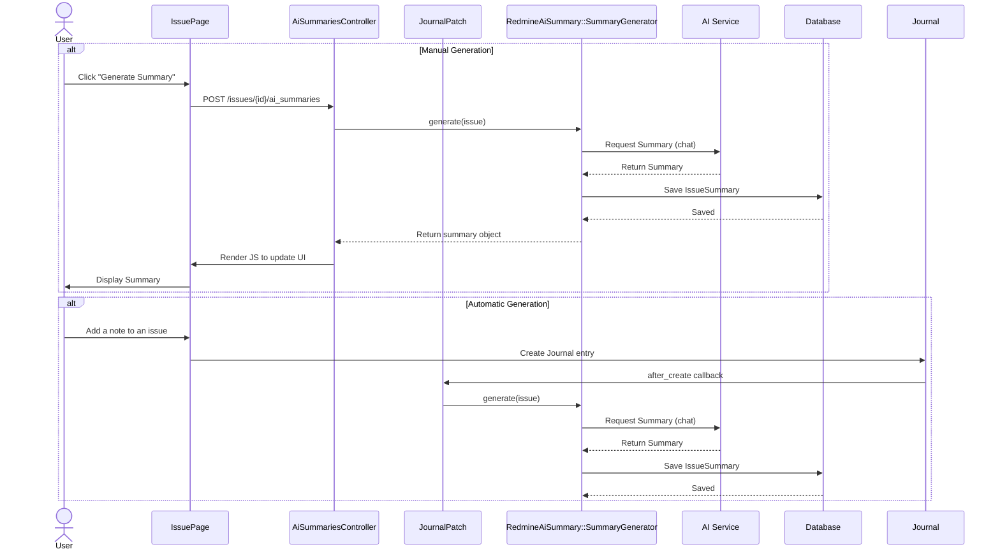

# Sequence Diagram

This diagram shows the sequence of events for both manual and automatic summary generation.

```mermaid
sequenceDiagram
    actor User
    participant IssuePage
    participant AiSummariesController
    participant JournalPatch
    participant SummaryGenerator as RedmineAiSummary::SummaryGenerator
    participant AI_API as AI Service
    participant Database

    alt Manual Generation
        User->>IssuePage: Click "Generate Summary"
        IssuePage->>AiSummariesController: POST /issues/{id}/ai_summaries
        AiSummariesController->>SummaryGenerator: generate(issue)
        SummaryGenerator->>AI_API: Request Summary (chat)
        AI_API-->>SummaryGenerator: Return Summary
        SummaryGenerator->>Database: Save IssueSummary
        Database-->>SummaryGenerator: Saved
        SummaryGenerator-->>AiSummariesController: Return summary object
        AiSummariesController->>IssuePage: Render JS to update UI
        IssuePage->>User: Display Summary
    end

    alt Automatic Generation
        User->>IssuePage: Add a note to an issue
        IssuePage->>Journal: Create Journal entry
        Journal->>JournalPatch: after_create callback
        JournalPatch->>SummaryGenerator: generate(issue)
        SummaryGenerator->>AI_API: Request Summary (chat)
        AI_API-->>SummaryGenerator: Return Summary
        SummaryGenerator->>Database: Save IssueSummary
        Database-->>SummaryGenerator: Saved
    end
```
